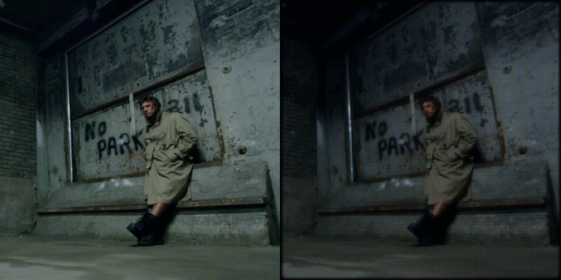

# libretro-renderer

**libretro-renderer** is a high-performance, command-line offline video renderer that applies [RetroArch](https://www.retroarch.com/) (`.slangp`) shader presets to video files using headless Vulkan.

Turn any video into an authentic retro CRT monitor, vintage VHS tape, or clean pixel-art upscale with the full power of RetroArch's extensive shader ecosystem.



---

## Features

- **Headless GPU Acceleration**: Runs entirely in the background via Vulkan off-screen rendering without opening windows.
- **Full `.slangp` Preset Support**: Powered by [librashader](https://github.com/SnowflakePowered/librashader) with full support for complex multi-pass pipelines (e.g. `crt-royale`, `crt-geom`, `crt-guest-advanced`), LUT textures, mipmap generation, and bloom passes.
- **Smart Scaling**:
  - Downscale modern videos to authentic retro resolutions (`--input-width` / `--input-height`, e.g. 240p or 480p) so shaders produce true, thick scanlines.
  - Upscale output to crisp 1080p, 1440p, or 4K (`--width` / `--height`) to accurately resolve phosphor triads and shadow masks.
- **Lossless Audio Preservation**: Automatically extracts and muxes the source audio track directly into the encoded video with zero quality loss.
- **Hardware Encoding Support**: Compatible with any FFmpeg encoder, including hardware acceleration (`h264_nvenc`, `hevc_nvenc`, `h264_amf`, `h264_qsv`).

---

## Requirements

1. **Vulkan-compatible GPU & drivers** (NVIDIA, AMD, Intel, or Apple Silicon with MoltenVK).
2. **[FFmpeg](https://ffmpeg.org/)** and **`ffprobe`** installed and available in your system `PATH`.
3. **[slang-shaders](https://github.com/libretro/slang-shaders)**: Clone or download the RetroArch slang shader collection.

---

## Quick Start

### Build from source

Ensure you have Rust installed (version 1.85+ recommended for Edition 2024):

```bash
git clone https://github.com/<your-username>/libretro-renderer.git
cd libretro-renderer
cargo build --release
```

The optimized binary will be located at `target/release/libretro-renderer`.

---

## Usage

```bash
libretro-renderer [OPTIONS] --input <INPUT> --shader <SHADER> --output <OUTPUT>
```

### Options Reference

| Option                 | Short |  Default   | Description                                                     |
| :--------------------- | :---: | :--------: | :-------------------------------------------------------------- |
| `--input <PATH>`       | `-i`  | _Required_ | Path to the input video file                                    |
| `--shader <PATH>`      | `-s`  | _Required_ | Path to the RetroArch `.slangp` shader preset                   |
| `--output <PATH>`      | `-o`  | _Required_ | Path for the output video file                                  |
| `--width <U32>`        |       |   Native   | Output video width                                              |
| `--height <U32>`       |       |   Native   | Output video height                                             |
| `--input-width <U32>`  |       |   Native   | Downscale input width before applying shader                    |
| `--input-height <U32>` |       |   Native   | Downscale input height before applying shader                   |
| `--encoder <NAME>`     |       | `libx264`  | FFmpeg video encoder (`libx264`, `h264_nvenc`, `libx265`, etc.) |
| `--crf <U32>`          |       |    `18`    | CRF quality level (lower = better quality)                      |
| `--preset <NAME>`      |       |   `slow`   | Encoder preset (`slow`, `medium`, `fast`, `p4`, `p5`, etc.)     |
| `--pixel-format <FMT>` |       | `yuv420p`  | Output pixel format for encoding                                |

---

## Examples

### 1. Fast CRT Effect (Native Resolution)

```bash
libretro-renderer -i gameplay.mp4 -s "slang-shaders/crt/crt-easymode.slangp" -o crt_output.mp4
```

### 2. High-Quality 1080p CRT with Curvature (`crt-geom`)

```bash
libretro-renderer -i gameplay.mp4 -s "slang-shaders/crt/crt-geom.slangp" -o crt_1080p.mp4 --width 1080 --height 1080
```

### 3. Emulate 240p Retro Console with Authentic CRT Scanlines

Take modern 1080p footage, downscale to 240p console resolution, and render at 1080p so CRT scanlines look authentic:

```bash
libretro-renderer -i 1080p_capture.mp4 \
  -s "slang-shaders/crt/crt-royale.slangp" \
  -o crt_royale_1080p.mp4 \
  --input-height 240 \
  --width 1920 \
  --height 1080
```

### 4. Fast Hardware Encoding on NVIDIA GPUs (NVENC)

```bash
libretro-renderer -i video.mp4 \
  -s "slang-shaders/crt/crt-geom.slangp" \
  -o output.mp4 \
  --encoder h264_nvenc \
  --preset p4
```
